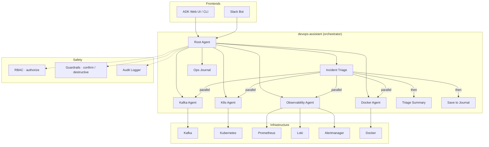

# AI Agents for DevOps & SRE

An open-source platform for building autonomous DevOps and SRE agents. Built with [Google ADK](https://google.github.io/adk-docs/) and managed as a [uv workspace](https://docs.astral.sh/uv/concepts/workspaces/).

Agents can monitor infrastructure, diagnose issues, and take action — with built-in safety guardrails that require human confirmation before any destructive operation. Interact via the ADK web UI, terminal, or directly from Slack.


## Key Features

- **Multi-agent orchestration** — a root agent delegates to specialized sub-agents based on user intent
- **Structured workflows** — `SequentialAgent` and `ParallelAgent` for deterministic multi-step pipelines (e.g., incident triage checks Kafka, K8s, Docker, and observability in parallel, then summarizes)
- **Slack integration** — chat with the agent from Slack, with interactive Approve/Deny buttons for guarded operations
- **Role-based access control** — three-role hierarchy (viewer/operator/admin) inferred from guardrail decorators; enforced via `authorize()` callback ([ADR-001](docs/adr/001-rbac.md))
- **Safety guardrails** — destructive tools (`@destructive`) require explicit confirmation; mutating tools (`@confirm`) prompt before executing
- **Structured logging** — JSON-formatted logs to stdout, ready for Loki/ELK/Cloud Logging; every tool call is audited with timestamp, agent, arguments, and result
- **Persistent sessions** — SQLite-backed session state, user-scoped notes, and app-wide shared data that survive restarts
- **Composable architecture** — each agent is a standalone package that can run independently or plug into an orchestrator

## Architecture



## Agents

| Agent | Type | Description |
|-------|------|-------------|
| [**core**](core/) | Library | Agent factory, RBAC, guardrails, error handlers, structured logging, audit trail, activity tracking, persistent runner, typed config |
| [**kafka-health-agent**](agents/kafka-health/) | Single agent | Kafka cluster health, topics, consumer groups, lag |
| [**k8s-health-agent**](agents/k8s-health/) | Single agent | Kubernetes cluster health, nodes, pods, deployments, logs, events |
| [**observability-agent**](agents/observability/) | Single agent | Prometheus metrics/alerts, Loki log queries, Alertmanager silence management |
| [**devops-assistant**](agents/devops-assistant/) | Multi-agent | Orchestrator that delegates to kafka, k8s, observability, docker, and journal sub-agents |
| [**ops-journal**](agents/ops-journal/) | Memory/state | Notes, preferences, and session tracking with persistent storage |
| [**slack-bot**](agents/slack-bot/) | Integration | Slack bot with thread-based sessions and interactive confirmation buttons |

## Quick Start

### Try it with Docker (no install required)

The only prerequisite is [Docker](https://docs.docker.com/get-docker/) and a [Google AI Studio API key](https://aistudio.google.com/apikey).

```bash
# Clone and start everything — infra + agent web UI
GOOGLE_API_KEY=your-api-key docker compose --profile demo up -d

# Open the web UI
open http://localhost:8000
```

This starts Kafka, Zookeeper, Kafka UI, Prometheus, Loki, Alertmanager, and the devops-assistant agent with a chat interface.

### Local development

```bash
make install      # install all workspace packages
make infra-up     # start Kafka, Zookeeper, Prometheus, Loki, Alertmanager
make run-devops   # launch the devops-assistant in ADK Dev UI
```

Run `make help` to see all available commands.

### Prerequisites

- **Docker only** for the quick start above
- For local development: [uv](https://docs.astral.sh/uv/), [Docker](https://docs.docker.com/get-docker/), and a Google AI Studio API key or Vertex AI project

## Slack Bot

Chat with the agent directly from Slack — each thread is a separate conversation, with interactive Approve/Deny buttons for guarded operations.

→ **[Full setup guide](docs/slack-setup.md)** (app manifest, env vars, run commands)

## Configuration

Each agent loads typed settings from `.env` files via Pydantic. Shared variables (GCP project, model version) plus per-agent settings (broker addresses, API tokens, etc.) are documented in the configuration reference.

→ **[Configuration reference](docs/configuration.md)** (env vars, infrastructure ports, Docker Compose profiles)

## Testing

Run the full suite (237 tests):

```bash
make test
```

Run tests for a single package:

```bash
uv run pytest agents/kafka-health/tests/ -v
```

All external dependencies (Kafka, Kubernetes, Docker, Slack) are mocked — no running infrastructure needed.

## Adding a New Agent

→ **[Step-by-step guide](docs/adding-an-agent.md)** with boilerplate, RBAC setup, and testing tips.

## Contributing

Contributions are welcome! See [CONTRIBUTING.md](CONTRIBUTING.md) for guidelines on adding new agents, improving existing ones, and submitting pull requests.

## License

This project is licensed under the [MIT License](LICENSE).
