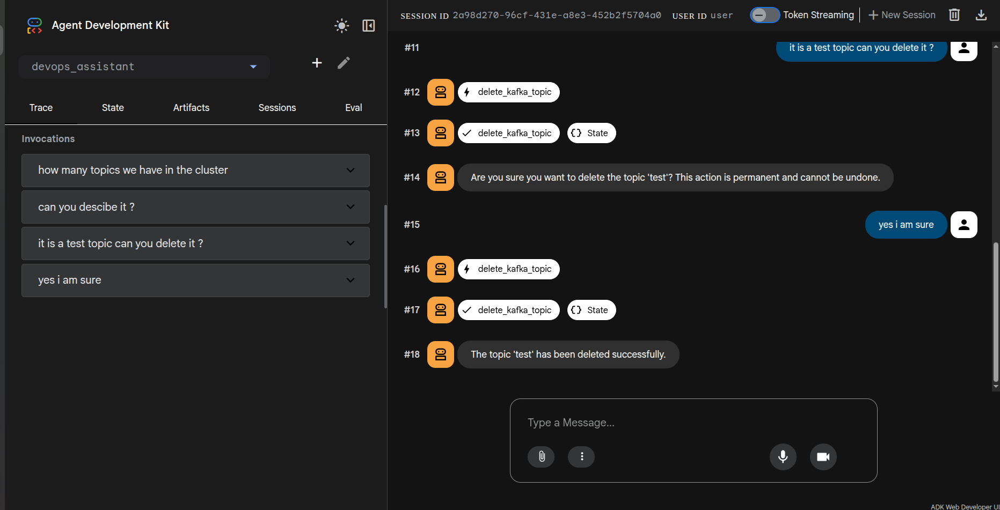

# orrery-core

Shared library providing the foundation for all agents: agent factory, plugins, RBAC, guardrails, input validation, audit logging, resilience, and typed configuration.

## Tool Results

### `ToolResult`

A Pydantic model for structured tool outputs. While agents can return raw dicts, using `ToolResult` ensures consistency and enables machine-readable error handling for cross-agent composition (e.g., remediation loops).

```python
from orrery_core import ToolResult

async def my_tool(name: str) -> dict:
    if not name:
        return ToolResult.error("Name is required", error_type="MissingInput").to_dict()
    
    return ToolResult.ok(message=f"Hello {name}", length=len(name)).to_dict()
```

- **Factories**: `ok()`, `error()`, `partial()`.
- **Fields**: `status`, `message`, `error_type`, `data`, `remediation_hints`.
- **Flattening**: `.to_dict()` flattens `data` into the top level for backward compatibility with legacy consumers while keeping reserved fields (`status`, `message`, etc.) safe.

## Operator Registry

### `OperatorRegistry`

A central registry for Kubernetes operator awareness. It allows agents to reason about high-level custom resources (like Strimzi `Kafka` or ECK `Elasticsearch`) instead of just low-level Pods.

```python
from orrery_core import default_registry

# Look up a detector by CRD group
detector = default_registry.get_by_group("kafka.strimzi.io")

# Interpret raw CR status into a unified OperatorStatus
status = detector.interpret_status("Kafka", raw_cr_dict)
print(status.healthy, status.phase, status.warnings)
```

Ships with built-in support for **Strimzi** and **ECK**. New operators can be registered by implementing the `OperatorDetector` protocol.

## Plugins

Cross-cutting concerns are packaged as ADK `BasePlugin` subclasses and registered once on the `Runner` via `default_plugins()`. Plugins apply globally to every agent, tool, and LLM call — no per-agent callback wiring needed.

### `default_plugins()`

Creates the standard set of plugins in the correct registration order:

```python
from orrery_core import default_plugins
from google.adk.runners import Runner

runner = Runner(
    agent=root_agent,
    app_name="myapp",
    session_service=session_service,
    plugins=default_plugins(),
)
```

| Order | Plugin | Description |
|-------|--------|-------------|
| 1 | `GuardrailsPlugin` | RBAC (`authorize()`) + confirmation gate (`require_confirmation()` or `dry_run()`) + `ensure_default_role()` |
| 2 | `ResiliencePlugin` | Per-tool circuit breaker |
| 3 | `MetricsPlugin` | Prometheus metrics (tool counts, latency, errors, circuit breaker state) |
| 4 | `AuditPlugin` | Structured audit logging for every tool invocation |
| 5 | `ActivityPlugin` | Records tool calls to session state for cross-agent visibility |
| 6 | `ErrorHandlerPlugin` | Graceful error recovery for tool and model failures (must be last) |

Parameters:

| Parameter | Default | Description |
|-----------|---------|-------------|
| `role_policy` | `None` | Custom `RolePolicy` for RBAC overrides |
| `guardrail_mode` | `"confirm"` | `"confirm"`, `"dry_run"`, or `"none"` |
| `circuit_breaker_threshold` | `5` | Failures before circuit opens |
| `circuit_breaker_timeout` | `60.0` | Recovery timeout in seconds |
| `audit_log_path` | `None` | Optional local audit log file path |
| `enable_activity_tracking` | `True` | Whether to track activity in session state |

### Individual plugins

Each plugin can also be instantiated independently for custom configurations:

```python
from orrery_core import (
    GuardrailsPlugin, ResiliencePlugin, MetricsPlugin,
    AuditPlugin, ActivityPlugin, ErrorHandlerPlugin,
)

plugins = [
    GuardrailsPlugin(mode="dry_run"),      # dry-run mode for testing
    ResiliencePlugin(failure_threshold=3),  # custom threshold
    MetricsPlugin(),
    AuditPlugin(log_path="audit.jsonl"),   # also write to local file
    ErrorHandlerPlugin(),
]
```

### Plugins vs callbacks

Plugins registered on the `Runner` apply globally and run **before** any agent-level callbacks. If a plugin returns a value, the agent-level callback is skipped. Use agent-level callbacks only for agent-specific logic (e.g., Slack's custom confirmation buttons).

---

## Agent Factory

### `create_agent()`

Creates an ADK Agent with sensible defaults. Since cross-cutting concerns are handled by plugins, agent definitions are simple:

```python
from orrery_core import create_agent, load_agent_env

load_agent_env(__file__)

root_agent = create_agent(
    name="my_agent",
    description="What this agent does.",
    instruction="How the agent should behave.",
    tools=[my_tool, another_tool],
)
```

| Parameter | Description |
|-----------|-------------|
| `name` | Agent name (used by ADK for routing) |
| `description` | Used by parent orchestrators to decide when to delegate |
| `instruction` | System prompt for the agent |
| `tools` | List of async tool functions |
| `model` | Override model — can be a string (Gemini) or `BaseLlm` instance (LiteLlm). When `None`, resolved from `MODEL_PROVIDER`/`MODEL_NAME` env vars via `resolve_model()` |
| `sub_agents` | List of child agents for orchestrators |
| `output_key` | Session state key to store this agent's output |

Agent-level callback parameters (`before_tool_callback`, `after_tool_callback`, etc.) are still supported for agent-specific logic but are not needed for standard cross-cutting concerns.

### `create_sequential_agent()` / `create_parallel_agent()`

Factory functions for structured multi-agent workflows that don't rely on LLM delegation.

```python
from orrery_core import create_agent, create_sequential_agent, create_parallel_agent

# Run health checks in parallel
health_checks = create_parallel_agent(
    name="health_checks",
    description="Runs all health checks concurrently.",
    sub_agents=[kafka_checker, k8s_checker, docker_checker],
)

# Sequential pipeline: check → summarize → save
triage = create_sequential_agent(
    name="incident_triage",
    description="Full incident triage pipeline.",
    sub_agents=[health_checks, summarizer, journal_writer],
)
```

Sub-agents pass data via `output_key`, which writes to session state for downstream agents to read.

### `load_agent_env(__file__)`

Loads the `.env` file located next to the calling module.

---

## Async Tools

All tool functions must be `async def`. Use `asyncio.to_thread()` or `asyncio.create_subprocess_exec()` to offload blocking I/O:

```python
import asyncio
from orrery_core import with_retry, destructive

@with_retry(max_retries=3, retryable=(ConnectionError, TimeoutError))
async def list_topics() -> dict:
    admin = _get_admin_client()
    metadata = await asyncio.to_thread(admin.list_topics, timeout=10)
    return {"status": "success", "topics": list(metadata.topics.keys())}

@destructive("permanently deletes the topic")
async def delete_topic(topic_name: str) -> dict:
    ...
```

The `@with_retry` decorator automatically detects async functions and uses `await asyncio.sleep()` for backoff delays.

---

## Resilience

Fault-tolerance utilities for handling transient failures and service outages.

### `ResiliencePlugin` / `CircuitBreaker`

Per-tool circuit breaker applied globally via the `ResiliencePlugin`. When a tool exceeds the failure threshold, subsequent calls are short-circuited until a recovery timeout allows a probe.

| State | Behavior |
|-------|----------|
| **Closed** | All calls pass through normally |
| **Open** | Calls are blocked with `{"error_type": "CircuitOpen", ...}` |
| **Half-open** | One probe call is allowed after `recovery_timeout` seconds |

### `@with_retry`

Decorator for async tool functions that adds retry with exponential backoff and jitter.

```python
from orrery_core import with_retry

@with_retry(max_retries=3, retryable=(ConnectionError, TimeoutError))
async def list_kafka_topics(timeout: int = 10) -> dict:
    ...
```

| Parameter | Default | Description |
|-----------|---------|-------------|
| `max_retries` | `3` | Max retry attempts (total calls = max_retries + 1) |
| `base_delay` | `1.0` | Initial backoff delay in seconds |
| `max_delay` | `30.0` | Cap on backoff delay |
| `retryable` | `(ConnectionError, TimeoutError, OSError)` | Exception types that trigger a retry |

Apply `@with_retry` to **read-only** tools that call external services. Do not apply to mutating operations (create, delete) where retries could be dangerous.

---

## Error Handling

### `ErrorHandlerPlugin`

Handles both tool and model errors globally. When a tool raises an exception, it returns a structured error dict so the LLM can reason about it:

```json
{"status": "error", "error_type": "KafkaException", "message": "Tool 'get_kafka_cluster_health' failed: broker down"}
```

When a model call fails, it returns a friendly `LlmResponse` message.

The underlying factories (`graceful_tool_error()`, `graceful_model_error()`) can still be used directly as agent-level callbacks if needed.

---

## Input Validation

Reusable validators for tool inputs. Each returns `None` on success or `{"status": "error", "message": ...}` on failure. Use the walrus operator for concise early-return:

```python
from orrery_core.validation import validate_string, validate_positive_int, KAFKA_TOPIC_PATTERN

async def create_kafka_topic(topic_name: str, num_partitions: int = 1) -> dict:
    if err := validate_string(topic_name, "topic_name", pattern=KAFKA_TOPIC_PATTERN):
        return err
    if err := validate_positive_int(num_partitions, "num_partitions", max_value=10_000):
        return err
    ...
```

### Available Validators

| Validator | Key Parameters | Description |
|-----------|---------------|-------------|
| `validate_string()` | `min_len`, `max_len`, `pattern` | Length bounds + optional regex |
| `validate_positive_int()` | `min_value`, `max_value` | Integer range (rejects bool, float, str) |
| `validate_url()` | `allowed_schemes` | Scheme allowlist; rejects `javascript:`, `data:`, `file:` |
| `validate_path()` | — | Rejects `..` path traversal |
| `validate_list()` | `min_len`, `max_len` | List length bounds |

### Constants

| Constant | Value | Usage |
|----------|-------|-------|
| `MAX_LOG_LINES` | `10,000` | Cap for log tail parameters |
| `MAX_REPLICAS` | `1,000` | Cap for K8s replica scaling |
| `MAX_PARTITIONS` | `10,000` | Cap for Kafka topic partitions |
| `MAX_REPLICATION_FACTOR` | `10` | Cap for Kafka replication factor |
| `MAX_QUERY_LENGTH` | `5,000` | Cap for Prometheus/Loki queries |
| `K8S_NAME_PATTERN` | `^[a-z0-9]([a-z0-9._-]*[a-z0-9])?$` | Kubernetes resource name format |
| `KAFKA_TOPIC_PATTERN` | `^[a-zA-Z0-9._-]+$` | Kafka topic name format |

---

## Guardrails

Guardrails prevent destructive tools from executing without confirmation. They are enforced globally via the `GuardrailsPlugin`.

### Marking tools as destructive

```python
from orrery_core import destructive

@destructive("permanently deletes the topic and all its data")
async def delete_kafka_topic(topic_name: str) -> dict:
    ...
```

The `@destructive()` decorator marks the function with metadata. The `GuardrailsPlugin` reads this metadata at runtime and gates execution.

### Confirmation flow

1. User asks to delete a topic
2. LLM calls `delete_kafka_topic`
3. `GuardrailsPlugin` intercepts → returns `{"status": "confirmation_required", ...}`
4. LLM receives the message and asks the user to confirm
5. User confirms → LLM calls the tool again → plugin allows it



*The guardrail intercepts `delete_kafka_topic` (#12-#13), asks the user to confirm (#14), and only executes after explicit confirmation (#15-#18).*

### Guardrail modes

| Mode | Behavior |
|------|----------|
| `"confirm"` (default) | Prompts for confirmation on `@confirm`/`@destructive` tools |
| `"dry_run"` | Blocks all destructive tools permanently, showing what would have been done |
| `"none"` | No confirmation gate (useful when the integration layer handles it, e.g., Slack buttons) |

---

## Role-Based Access Control (RBAC)

Three-role hierarchy that reuses existing guardrail metadata to control who can call which tools. See [ADR-001](../docs/adr/001-rbac.md) for the full design rationale.

```
VIEWER (0)   → read-only tools (unguarded)
OPERATOR (1) → + mutating tools (@confirm)
ADMIN (2)    → + destructive tools (@destructive)
```

RBAC is enforced globally by the `GuardrailsPlugin`. It runs before the confirmation gate — unauthorized users are blocked before reaching the confirmation prompt.

### `RolePolicy`

Maps tools to their minimum required role. By default, roles are inferred from `@destructive`/`@confirm` decorators. Use overrides for exceptions:

```python
from orrery_core import RolePolicy, Role, default_plugins

policy = RolePolicy(overrides={"sensitive_read": Role.OPERATOR})
plugins = default_plugins(role_policy=policy)
```

### `@requires_role()`

Decorator for explicit role annotation on tools that don't use `@destructive`/`@confirm`:

```python
from orrery_core import requires_role, Role

@requires_role(Role.ADMIN)
async def manage_users() -> dict:
    ...
```

### Setting the user role

Use `set_user_role()` to assign a role from trusted server-side code:

```python
from orrery_core import set_user_role

initial_state = {}
set_user_role(initial_state, "admin")
session = session_service.create_session(state=initial_state, ...)
```

Invalid role values default to `viewer`. The `GuardrailsPlugin` calls `ensure_default_role()` via `before_agent_callback` to prevent privilege escalation from untrusted session state.

### Testing roles across surfaces

For a hands-on guide to exercising `viewer` / `operator` / `admin` from ADK Web, `adk run`, Slack, Google Chat, and a custom `Runner`, see [Testing RBAC across surfaces](../docs/rbac-testing.md).

---

## Structured Logging

### `setup_logging()`

Configures the root Python logger with a JSON formatter that outputs structured log lines to stdout — container-friendly and ready for Loki, ELK, Splunk, or Cloud Logging.

```python
from orrery_core import setup_logging

setup_logging()  # call once at startup
```

Called automatically by `load_agent_env()`, so all agents get structured logging by default.

### `JSONFormatter`

The underlying `logging.Formatter` that produces JSON output. Can be used standalone if you need custom handler configuration.

---

## Audit Logging

### `AuditPlugin`

Emits a structured audit entry for every tool invocation via the `AuditPlugin`. Each entry includes agent name, tool name, arguments, result, user ID, and session ID.

Sensitive arguments (containing `password`, `secret`, `token`, `api_key`, `credential`) are automatically redacted to `***`.

An optional `audit_log_path` parameter in `default_plugins()` writes a local `.jsonl` file in addition to stdout.

---

## Activity Tracking

### `ActivityPlugin`

Records every tool call to `session_log` in session state via the `ActivityPlugin`. This makes all agent activity visible to `get_session_summary()` in the journal agent, regardless of which sub-agent performed the work.

---

## Typed Configuration

### `AgentConfig`

A pydantic-settings base class for typed, validated configuration. Replaces raw `os.getenv()` calls.

```python
from orrery_core import AgentConfig, load_config

class KafkaConfig(AgentConfig):
    kafka_bootstrap_servers: str = "localhost:9092"

config = load_config(KafkaConfig, __file__)
print(config.kafka_bootstrap_servers)
print(config.model_provider)   # "gemini", "anthropic", "openai", etc.
print(config.model_name)       # "gemini-2.0-flash", "anthropic/claude-sonnet-4-20250514", etc.
```

Base fields (inherited by all configs):

| Field | Default | Env var | Description |
|-------|---------|---------|-------------|
| `model_provider` | `"gemini"` | `MODEL_PROVIDER` | LLM backend (`gemini`, `anthropic`, `openai`, `ollama`, ...) |
| `model_name` | `"gemini-2.0-flash"` | `MODEL_NAME` | Model identifier |
| `google_genai_use_vertexai` | `True` | `GOOGLE_GENAI_USE_VERTEXAI` | Use Vertex AI or AI Studio (Gemini only) |
| `google_cloud_project` | `None` | `GOOGLE_CLOUD_PROJECT` | GCP project (Vertex AI only) |
| `google_cloud_location` | `None` | `GOOGLE_CLOUD_LOCATION` | GCP region (Vertex AI only) |
| `google_api_key` | `None` | `GOOGLE_API_KEY` | AI Studio API key (Gemini only) |
| `gemini_model_version` | `None` | `GEMINI_MODEL_VERSION` | Legacy alias for `MODEL_NAME` when provider is gemini |

### `resolve_model()`

Resolves the LLM model from environment variables. Called automatically by `create_agent()` when no explicit `model` is passed.

- For `MODEL_PROVIDER=gemini` (default): returns a plain model string
- For any other provider: returns a `LiteLlm` instance via ADK's built-in LiteLLM integration

See [Configuration reference](../docs/config/general.md) for provider-specific env vars and API key setup.

### `load_config(ConfigClass, __file__)`

Loads configuration from the `.env` file next to the calling module, with environment variable overrides.

---

## Persistent Runner

### `run_persistent()`

An async helper that runs an agent in a CLI loop with SQLite-backed sessions. Supports plugins.

```python
import asyncio
from orrery_core import run_persistent, default_plugins
from my_agent.agent import root_agent

asyncio.run(run_persistent(root_agent, app_name="my_agent", plugins=default_plugins()))
```

| Parameter | Default | Description |
|-----------|---------|-------------|
| `agent` | — | The root agent to run |
| `app_name` | — | Application name for session scoping |
| `db_url` | `sqlite:///{app_name}.db` | SQLAlchemy database URL |
| `user_id` | `"default_user"` | User ID for session scoping |
| `plugins` | `None` | List of ADK plugins (use `default_plugins()` for standard set) |

Session state (notes, preferences, bookmarks) survives across restarts. Type `new` for a fresh session or `quit` to exit.

For the web UI, use ADK's built-in persistence flag instead:

```bash
adk web --session_service_uri=sqlite:///my_agent.db agents/my-agent
```
