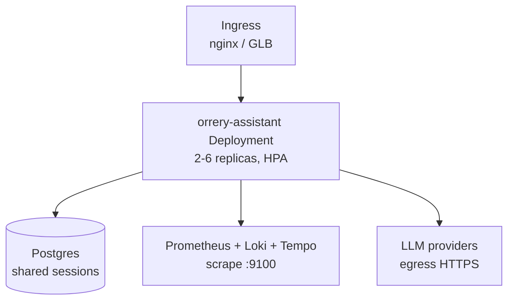

# Production Deployment Guide

This guide covers deploying the `orrery-assistant` agent platform to
Kubernetes with a shared Postgres session store, rolling updates, and
autoscaling. For local development, see [`getting-started.md`](getting-started.md)
and the `make docker-demo` target instead.

---

## Prerequisites

- A Kubernetes cluster (>= 1.25)
- `kubectl` and `helm` (>= 3.12) configured against the cluster
- A container registry account (GHCR, ECR, GCR, …) that the cluster can pull from
- A PostgreSQL database reachable from the cluster
- LLM provider credentials (Google AI Studio / Vertex / Anthropic / OpenAI)

---

## Architecture



The Slack bot, Google Chat bot, and ADK web UI run as separate
Deployments (same image, different entry points) so they can be scaled
independently. All share the Postgres session store.

---

## Step 1 — Build and push the image

CI publishes multi-arch images to GHCR automatically via
`.github/workflows/docker-publish.yml`. For out-of-band builds:

```bash
docker buildx build \
  --platform linux/amd64,linux/arm64 \
  -f Dockerfile \
  -t ghcr.io/bahalla/orrery:v0.1.9 \
  --push .
```

---

## Step 2 — Provision Postgres

The Slack bot and the orrery-assistant share a `DatabaseSessionService`
instance. For multi-replica deployments, **SQLite is not an option** —
it does not support concurrent writers and will silently corrupt
sessions under load.

Create a database and user:

```sql
CREATE USER agents WITH PASSWORD '<strong-password>';
CREATE DATABASE agents OWNER agents;
GRANT ALL PRIVILEGES ON DATABASE agents TO agents;
```

Then expose the URL to the cluster via a Secret:

```bash
kubectl -n orrery create secret generic orrery-assistant-secrets \
  --from-literal=DATABASE_URL="postgresql+asyncpg://agents:<pw>@postgres.orrery.svc.cluster.local:5432/agents" \
  --from-literal=GOOGLE_API_KEY="$GOOGLE_API_KEY"
```

For production, prefer **External Secrets Operator** syncing from AWS
Secrets Manager / GCP Secret Manager / HashiCorp Vault, or **Sealed
Secrets** for a GitOps flow — do not commit the Secret manifest.

ADK's `DatabaseSessionService` is built on SQLAlchemy and the schema
is created automatically on first use. You do **not** need to run a
migration step.

---

## Step 3 — Install via Helm

```bash
# Pull options
helm show values deploy/helm/orrery-assistant > my-values.yaml

# Edit my-values.yaml — at minimum set image.tag and existingSecret

helm upgrade --install orrery-assistant \
  deploy/helm/orrery-assistant \
  --namespace orrery --create-namespace \
  -f my-values.yaml
```

Recommended override file:

```yaml
image:
  repository: ghcr.io/bahalla/orrery
  tag: "v0.1.9"

# Use the Secret created in Step 2 instead of storing values in the chart.
existingSecret: orrery-assistant-secrets

config:
  MODEL_PROVIDER: gemini
  MODEL_NAME: gemini-2.0-flash
  KAFKA_BOOTSTRAP_SERVERS: kafka.data.svc.cluster.local:9092
  PROMETHEUS_URL: http://prometheus.observability.svc.cluster.local:9090

autoscaling:
  enabled: true
  minReplicas: 2
  maxReplicas: 6
  targetCPUUtilizationPercentage: 70

ingress:
  enabled: true
  className: nginx
  hosts:
    - host: agents.example.com
      paths:
        - path: /
          pathType: Prefix
  tls:
    - secretName: agents-tls
      hosts: [agents.example.com]
```

---

## Step 4 — Verify

```bash
# Pods come up and pass readiness
kubectl -n orrery get pods -l app.kubernetes.io/name=orrery-assistant

# Tail logs
kubectl -n orrery logs -l app.kubernetes.io/name=orrery-assistant -f

# Health endpoints
kubectl -n orrery port-forward svc/orrery-assistant 8080:8080
curl http://localhost:8080/healthz
curl http://localhost:8080/readyz

# Metrics endpoint (Prometheus scrape target)
kubectl -n orrery port-forward svc/orrery-assistant 9100:9100
curl http://localhost:9100/metrics | head -40

# ADK web UI
kubectl -n orrery port-forward svc/orrery-assistant 8000:8000
open http://localhost:8000
```

---

## Step 5 — Zero-downtime rolling updates

The Helm chart configures `maxSurge: 1, maxUnavailable: 0`, a 10-second
preStop sleep, and 60-second `terminationGracePeriodSeconds`. This
ensures:

1. The new pod must pass `/readyz` before the old one is drained.
2. The load balancer removes the old pod from rotation during the
   preStop sleep.
3. In-flight LLM calls (up to ~50s) have time to complete before SIGKILL.

Trigger a rollout:

```bash
helm upgrade orrery-assistant deploy/helm/orrery-assistant \
  -n orrery -f my-values.yaml \
  --set image.tag=v0.2.0

kubectl -n orrery rollout status deployment/orrery-assistant
```

Rollback:

```bash
kubectl -n orrery rollout undo deployment/orrery-assistant
# or
helm rollback orrery-assistant -n orrery
```

---

## Step 6 — Autoscaling

The HPA scales on CPU (70%) and memory (80%) utilization between 2 and 6
replicas. Scale-up is rate-limited to 1 pod per minute to avoid LLM bill
explosions on traffic spikes; scale-down requires a 5-minute stabilization
window.

For LLM-cost-sensitive workloads, consider switching to a custom metric
via the Prometheus Adapter (e.g. `llm_requests_in_flight`) — see the
forthcoming **AEP-015: Cost Observability** for per-tenant budgets.

---

## Troubleshooting

### Pods crash-loop on startup

Check the logs — the most common causes are:

- Missing `GOOGLE_API_KEY` / `ANTHROPIC_API_KEY` — the agent fails to
  reach its LLM and the readiness probe times out.
- `DATABASE_URL` points to a host the pod can't reach (wrong namespace,
  NetworkPolicy blocking egress). Test with a debug pod:
  `kubectl run -it --rm psql --image=postgres:16 -- psql $DATABASE_URL`
- `DatabaseSessionService` complains about missing driver: ensure the
  image was built with `uv sync --extra postgres` (the provided
  `Dockerfile` includes this by default).

### Readiness probe flaps

The startup probe allows up to 60 seconds (12 × 5s). If the agent is
still not ready after that, look for slow cold starts from:

- LLM warm-up calls in `before_agent_callback` plugins.
- Kafka / Prometheus client connection timeouts at boot — these are
  cached as module-level singletons and can block startup.

### Sessions not persisting across restarts

Verify `DATABASE_URL` is actually being read — the pod logs should print
`Using database session store: postgresql+asyncpg://...[REDACTED]@...`.
If you see `Using SQLite session store`, the env var isn't wired
(check the Secret is mounted via `envFrom`).

### LLM costs spike unexpectedly

Check the Prometheus metrics `llm_tokens_total` and the context cache
hit rate. The most common cause is that context caching is disabled
(Gemini-only) or the minimum token threshold is too high. See
[metrics.md](metrics.md) for the full dashboard.

---

## Related AEPs

- [AEP-011](enhancements/aep-011-deployment-hardening.md) — this guide's implementation
- AEP-013 — security hardening (JWT auth, PII redaction) — next up
- AEP-014 — supply chain security (SBOM, cosign signing)
- AEP-015 — cost observability and per-tenant budgets
