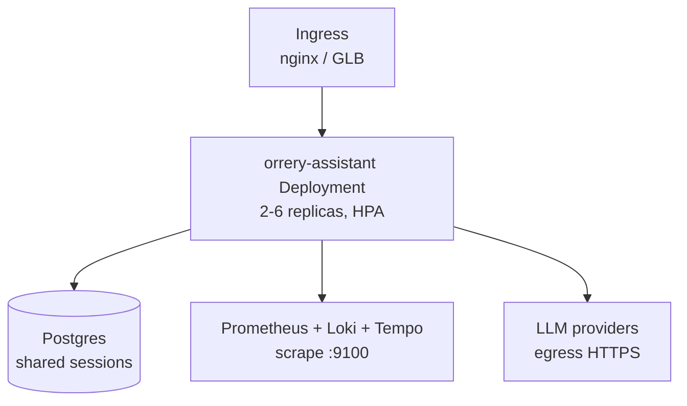

# Production Deployment Guide

This guide covers deploying the `orrery-assistant` agent platform to
Kubernetes with a shared Postgres session store, rolling updates, and
autoscaling. For local development, see [`getting-started.md`](getting-started.md)
and the `docker compose --profile demo up -d --build` demo stack instead.

---

## Prerequisites

- A Kubernetes cluster (>= 1.25)
- `kubectl` and `helm` (>= 3.12) configured against the cluster
- A container registry account (GHCR, ECR, GCR, …) that the cluster can pull from
- A PostgreSQL database reachable from the cluster
- LLM provider credentials (Google AI Studio / Vertex / Anthropic / OpenAI)

---

## Architecture


```mermaid
graph TD
    ING[Ingress<br/>nginx / GLB]
    ING --> DEP[orrery-assistant Deployment<br/>2-6 replicas, HPA]
    DEP --> PG[(Postgres<br/>shared sessions)]
    DEP --> OBS[Prometheus + Loki + Tempo<br/>scrape :9100]
    DEP --> LLM[LLM providers<br/>egress HTTPS]
```

The Slack bot, Google Chat bot, and ADK web UI run as separate
Deployments (same image, different entry points) so they can be scaled
independently. All share the Postgres session store.

---

## Step 1 — Build and push the image

The [Release & Publish](https://github.com/BAHALLA/orrery/blob/main/.github/workflows/release.yml)
workflow publishes multi-arch images to GHCR on every push to `main` (`:latest`,
`:sha-<short>`) and on every `v*.*.*` tag (`:X.Y.Z`, `:X.Y`), signed with cosign.
For out-of-band builds:

```bash
docker buildx build \
  --platform linux/amd64,linux/arm64 \
  -f Dockerfile \
  -t ghcr.io/bahalla/orrery:0.4.1 \
  --push .
```

---

## Step 2 — Provision Postgres

The Slack bot and the orrery-assistant share a `DatabaseSessionService`
instance. The platform supports only **in-memory** (no `DATABASE_URL`) or
**PostgreSQL** (`DATABASE_URL` set) stores — SQLite is not supported.
Multi-replica deployments **require** PostgreSQL; without a `DATABASE_URL`
sessions are in-memory and lost on restart.

When `DATABASE_URL` **is** set but the database is unreachable or unusable at
startup, the process **fails fast** (`DatabaseUnavailableError`) rather than
silently degrading to an in-memory store. This is deliberate: a silent fallback
would let a pod report healthy while trapping sessions in local memory —
split-brain across replicas, and permanent loss on restart. The failure keeps
the pod in `CrashLoopBackOff` until Postgres is genuinely ready. For **local
development only**, set `ORRERY_DB_ALLOW_INMEMORY_FALLBACK=1` to restore the
graceful in-memory fallback; never set it in production.

Create a database and user:

```sql
CREATE USER agents WITH PASSWORD '<strong-password>';
CREATE DATABASE agents OWNER agents;
GRANT ALL PRIVILEGES ON DATABASE agents TO agents;
```

Then expose the URL to the cluster via a Secret:

```bash
kubectl -n orrery create secret generic orrery-assistant-secrets \
  --from-literal=DATABASE_URL="postgresql+asyncpg://agents:<pw>@postgres.orrery.svc.cluster.local:5432/agents" \
  --from-literal=GOOGLE_API_KEY="$GOOGLE_API_KEY"
```

For production, prefer **External Secrets Operator** syncing from AWS
Secrets Manager / GCP Secret Manager / HashiCorp Vault, or **Sealed
Secrets** for a GitOps flow — do not commit the Secret manifest.

ADK's `DatabaseSessionService` is built on SQLAlchemy and the schema
is created automatically on first use. You do **not** need to run a
migration step.

---

## Step 3 — Install via Helm

```bash
# Pull options
helm show values deploy/helm/orrery-assistant > my-values.yaml

# Edit my-values.yaml — at minimum set image.tag and existingSecret.
# image.tag defaults to the chart's appVersion, so pinning it is optional
# when the chart and the image you want are the same release.

helm upgrade --install orrery-assistant \
  deploy/helm/orrery-assistant \
  --namespace orrery --create-namespace \
  -f my-values.yaml
```

Recommended override file:

```yaml
image:
  repository: ghcr.io/bahalla/orrery
  tag: "0.4.1"  # bare semver — the published tags carry no leading "v"

# Use the Secret created in Step 2 instead of storing values in the chart.
existingSecret: orrery-assistant-secrets

config:
  MODEL_PROVIDER: gemini
  MODEL_NAME: gemini-2.0-flash
  KAFKA_BOOTSTRAP_SERVERS: kafka.data.svc.cluster.local:9092
  PROMETHEUS_URL: http://prometheus.observability.svc.cluster.local:9090

autoscaling:
  enabled: true
  minReplicas: 2
  maxReplicas: 6
  targetCPUUtilizationPercentage: 70

ingress:
  enabled: true
  className: nginx
  hosts:
    - host: agents.example.com
      paths:
        - path: /
          pathType: Prefix
  tls:
    - secretName: agents-tls
      hosts: [agents.example.com]
```

---

## Step 4 — Enable authentication

If you are exposing the agent over HTTP (Ingress, `orrery_core.serving.server`,
`adk web`), turn on the JWT bearer-token front door before sending real
traffic. Without it, RBAC roles in the JWT are not verifiable and any
caller on the network can self-declare as `admin`. The Slack and Google
Chat bots authenticate at their own layer and are unaffected.

For the full threat model and provider-specific JWKS endpoints, see
[`config/security.md`](config/security.md).

### Option A — IdP-fronted (RS256/JWKS, recommended for production)

Most production deployments will sit behind Auth0, Keycloak, Okta, or
Google IAP. The chart only needs the JWKS URL and the audience/issuer
your IdP mints tokens with:

```yaml
auth:
  enabled: true
  algorithm: RS256
  jwksUrl: https://your-tenant.auth0.com/.well-known/jwks.json
  audience: https://orrery.your-org.com
  issuer: https://your-tenant.auth0.com/
  roleClaim: https://orrery.your-org.com/roles   # Auth0 custom claim
```

No `JWT_SECRET` is needed — public keys are fetched from the JWKS URL
and cached for 10 minutes.

### Option B — Shared secret (HS256, dev / gateway-fronted)

Suitable when a trusted gateway (Envoy, oauth2-proxy, internal SSO)
mints tokens with a shared secret, or for local testing.

```yaml
auth:
  enabled: true
  algorithm: HS256
  audience: orrery
  issuer: https://your-gateway

# Provide JWT_SECRET via the existingSecret created in Step 2 (preferred)
# or under `secrets` (Helm-managed). Keep it ≥ 32 bytes.
```

```bash
kubectl -n orrery patch secret orrery-assistant-secrets \
  --type=merge \
  -p "{\"stringData\":{\"JWT_SECRET\":\"$(openssl rand -hex 32)\"}}"
```

### Mount JWT_SECRET (and other secrets) via a file volume

For compliance-bound deployments where API keys must not appear in the
pod's environment, use the file-backed `SecretsManager`:

```yaml
secretsVolume:
  enabled: true
  secretName: orrery-secrets-volume   # created out-of-band by ESO / Vault / Sealed Secrets
  mountPath: /var/run/secrets/orrery
```

The chart sets `ORRERY_SECRETS_DIR` to the mount path, and each key in the
Secret becomes a file under it. When `orrery_core` is imported, before any
configuration is read, every file whose name is a valid environment-variable
name (`JWT_SECRET`, `DATABASE_URL`, `GOOGLE_API_KEY`, `SLACK_BOT_TOKEN`, …) is
loaded into the process environment. So it works for every consumer:
`os.getenv` readers, the agents' pydantic settings, and SDKs that read their own
key (Gemini, LiteLLM). The values never appear in the pod spec.

- A file **overrides** an `envFrom` variable of the same name (logged by name,
  never by value). Keys missing from the volume fall back to the environment,
  so this composes with the existing `envFrom` flow.
- Keys that cannot be variable names (`ca.crt`, `tls-key`) are left as files for
  path-based settings, and so are files over 64 KiB.
- Values are read at startup: **restart the pods after rotating a secret**.

### Roll out

```bash
helm upgrade orrery-assistant deploy/helm/orrery-assistant \
  -n orrery -f my-values.yaml

kubectl -n orrery rollout status deployment/orrery-assistant
```

Verify the rollout enforces auth:

```bash
kubectl -n orrery port-forward svc/orrery-assistant 8000:8000

# Unauthenticated call → 401
curl -i http://localhost:8000/chat -d '{"message":"hi"}' -H 'Content-Type: application/json'
# HTTP/1.1 401 Unauthorized
# WWW-Authenticate: Bearer

# /healthz and /readyz remain unauthenticated by design.
curl http://localhost:8000/healthz
```

---

## Step 5 — Verify

```bash
# Pods come up and pass readiness
kubectl -n orrery get pods -l app.kubernetes.io/name=orrery-assistant

# Tail logs
kubectl -n orrery logs -l app.kubernetes.io/name=orrery-assistant -f

# Health endpoints
kubectl -n orrery port-forward svc/orrery-assistant 8080:8080
curl http://localhost:8080/healthz
curl http://localhost:8080/readyz

# Metrics endpoint (Prometheus scrape target)
kubectl -n orrery port-forward svc/orrery-assistant 9100:9100
curl http://localhost:9100/metrics | head -40

# ADK web UI
kubectl -n orrery port-forward svc/orrery-assistant 8000:8000
open http://localhost:8000
```

---

## Step 6 — Zero-downtime rolling updates

The Helm chart configures `maxSurge: 1, maxUnavailable: 0`, a 10-second
preStop sleep, and 60-second `terminationGracePeriodSeconds`. This
ensures:

1. The new pod must pass `/readyz` before the old one is drained.
2. The load balancer removes the old pod from rotation during the
   preStop sleep.
3. In-flight LLM calls (up to ~50s) have time to complete before SIGKILL.

Trigger a rollout:

```bash
helm upgrade orrery-assistant deploy/helm/orrery-assistant \
  -n orrery -f my-values.yaml \
  --set image.tag=0.4.1

kubectl -n orrery rollout status deployment/orrery-assistant
```

Rollback:

```bash
kubectl -n orrery rollout undo deployment/orrery-assistant
# or
helm rollback orrery-assistant -n orrery
```

---

## Step 7 — Autoscaling

The HPA scales on CPU (70%) and memory (80%) utilization between 2 and 6
replicas. Scale-up is rate-limited to 1 pod per minute to avoid LLM bill
explosions on traffic spikes; scale-down requires a 5-minute stabilization
window.

For LLM-cost-sensitive workloads, consider switching to a custom metric
via the Prometheus Adapter (e.g. `llm_requests_in_flight`) — see the
forthcoming **AEP-015: Cost Observability** for per-tenant budgets.

---

## Troubleshooting

!!! tip "Running this on-call? Start with the runbooks."
    This section covers problems you hit while *installing*. Once the platform
    is serving traffic, the [runbooks](runbooks/README.md) are the operational
    reference — begin with the
    [on-call checklist](runbooks/oncall-checklist.md), and note that every
    Prometheus alert carries a `runbook_url` annotation pointing straight at
    the right page.

### Pods crash-loop on startup

Check the logs — the most common causes are:

- Missing `GOOGLE_API_KEY` / `ANTHROPIC_API_KEY` — the agent fails to
  reach its LLM and the readiness probe times out.
- `DATABASE_URL` points to a host the pod can't reach (wrong namespace,
  NetworkPolicy blocking egress). Test with a debug pod:
  `kubectl run -it --rm psql --image=postgres:16 -- psql $DATABASE_URL`
- `DatabaseSessionService` complains about missing driver: ensure the
  image was built with `uv sync --extra postgres` (the provided
  `Dockerfile` includes this by default).
- `auth.enabled=true` but `JWT_SECRET` is unset (HS256) or
  `JWT_JWKS_URL` is unset (RS256). `create_app()` calls
  `cfg.jwt.validate()` at startup precisely so this fails fast — look
  for `JWT_SECRET is required` / `JWT_JWKS_URL is required` in the
  logs.

### `401 Invalid token` on every `/chat` call after enabling auth

- The token's `aud` / `iss` claims don't match `auth.audience` /
  `auth.issuer` in `values.yaml`. The server rejects mismatched tokens
  silently to avoid leaking the validation strategy — turn on
  `LOG_LEVEL=DEBUG` to see the underlying PyJWT error.
- Clock drift between the IdP and the cluster exceeds
  `auth.leewaySeconds` (default 30s). NTP is the right fix; don't
  raise leeway above 60s in production.
- For RS256/JWKS, the IdP rotated its signing keys and the pod's
  in-memory JWKS cache is stale. The cache expires every 10 minutes;
  if you need a faster cut, restart the pod.

### Readiness probe flaps

The startup probe allows up to 60 seconds (12 × 5s). If the agent is
still not ready after that, look for slow cold starts from:

- LLM warm-up calls in `before_agent_callback` plugins.
- Kafka / Prometheus client connection timeouts at boot — these are
  cached as module-level singletons and can block startup.

### Sessions not persisting across restarts

Verify `DATABASE_URL` is actually being read — the pod logs should print
`Using PostgreSQL session store: postgresql+asyncpg://...[REDACTED]@...`.
If you see `Using in-memory session store`, the env var isn't wired
(check the Secret is mounted via `envFrom`).

### LLM costs spike unexpectedly

Check the Prometheus metrics `llm_tokens_total` and the context cache
hit rate. The most common cause is that context caching is disabled
(Gemini-only) or the minimum token threshold is too high. See
[metrics.md](metrics.md) for the full dashboard.

---

## Related AEPs

- [AEP-011](enhancements/aep-011-deployment-hardening.md) — this guide's implementation
- [AEP-013](enhancements/aep-013-security-hardening.md) — security hardening; JWT auth landed in Step 4 above. PII redaction + prompt-injection screening + Gemini safety filters are the remaining sub-PRs.
- AEP-014 — supply chain security (SBOM, cosign signing, image scan gate)
- AEP-015 — cost observability and per-tenant budgets
