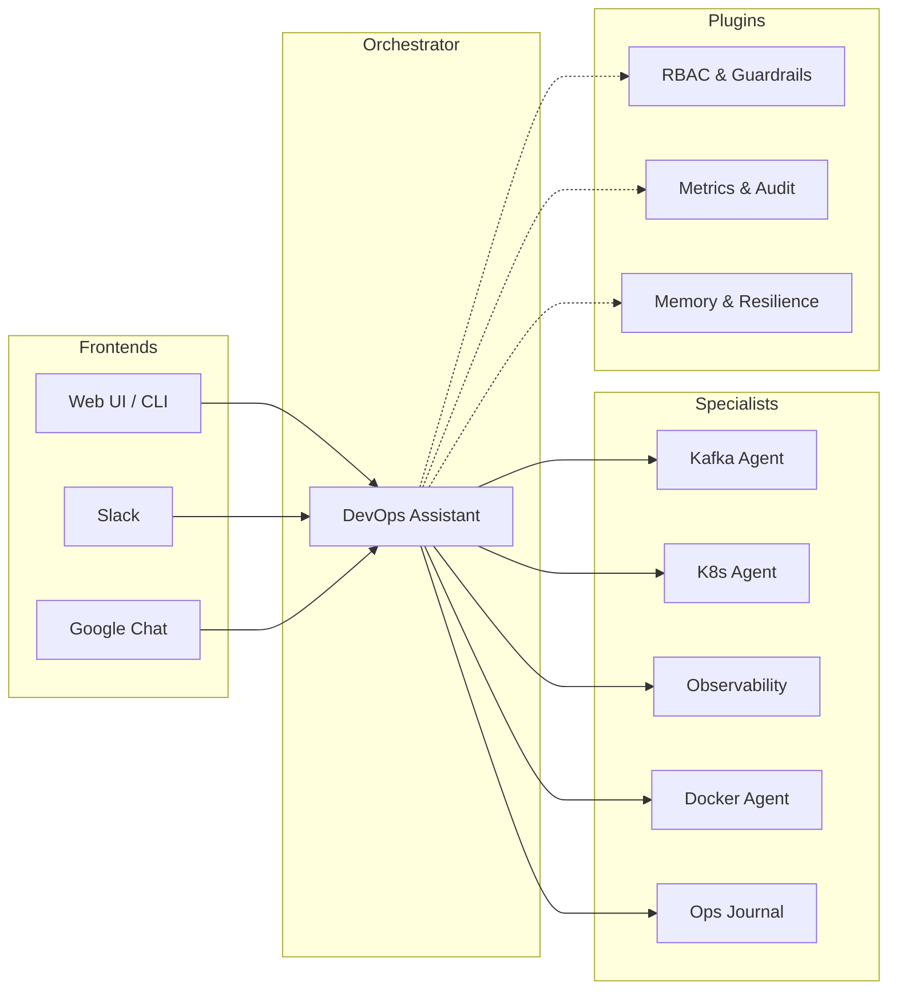

# 🤖 AI Agents for DevOps & SRE

Welcome to the documentation for the **AI Agents** platform — an open-source framework for building autonomous DevOps and SRE agents. Built with [Google ADK](https://google.github.io/adk-docs/) and managed as a [uv workspace](https://docs.astral.sh/uv/).

{ align=center }

---

## 🏗️ Architecture Overview

The platform follows a **Coordinator-Specialist** pattern. A root orchestrator analyzes user intent and delegates to specialized agents. Cross-cutting concerns like safety, observability, and resilience are handled globally via a plugin system.

---

## ⚡ Quick Access

-   :material-rocket-launch:{ .lg .middle } __[Getting Started](getting-started.md)__

    ---

    Launch the platform in 5 minutes using Docker and try your first triage.

-   :material-book-open-variant:{ .lg .middle } __[Adding an Agent](adding-an-agent.md)__

    ---

    Learn how to build and test your own specialist agents using our core library.

-   :material-shield-lock:{ .lg .middle } __[Safety & Governance](adr/001-rbac.md)__

    ---

    Understand how our 3-role hierarchy and guardrails protect your infrastructure.

-   :material-chart-bar:{ .lg .middle } __[Observability](metrics.md)__

    ---

    Explore built-in Prometheus metrics and how to track agent performance.

---

## 🧠 Core Philosophy

1.  **Safety First:** No destructive tool executes without verified human confirmation.
2.  **Autonomous Investigation:** Agents run diagnostics in parallel, mimicking an SRE's thought process.
3.  **Closed-Loop Remediation:** Actions are always followed by verification and retry loops.
4.  **Observable by Design:** Every interaction is instrumented with Prometheus metrics and audit logs.

---

## 📂 Project Structure

| Component | Path | Description |
|-----------|------|-------------|
| [**core**](core/README.md) | `core/` | Shared library: agent factories, plugin system, validation, and base configurations. |
| [**agents**](agents/devops-assistant.md) | `agents/` | Specialist agent implementations (Kafka, K8s, Docker, etc.). |
| [**infra**](config/general.md#infrastructure) | `infra/` | Local diagnostic stack (Prometheus, Loki, Kafka, Grafana). |
| [**roadmap**](enhancements/README.md) | `docs/enhancements/` | Ongoing development and enhancement proposals (AEP). |
