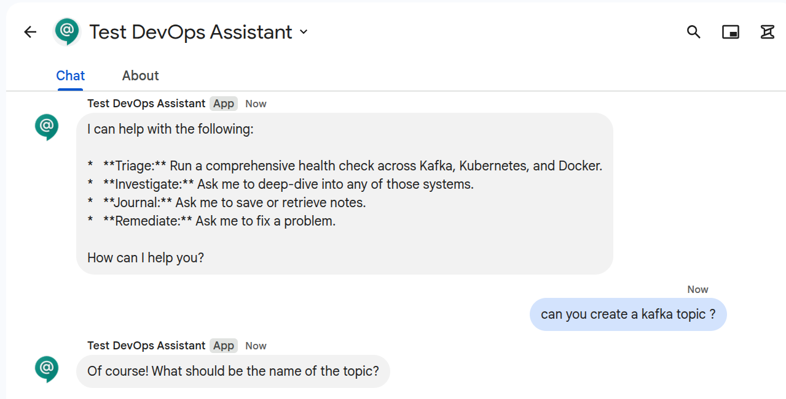
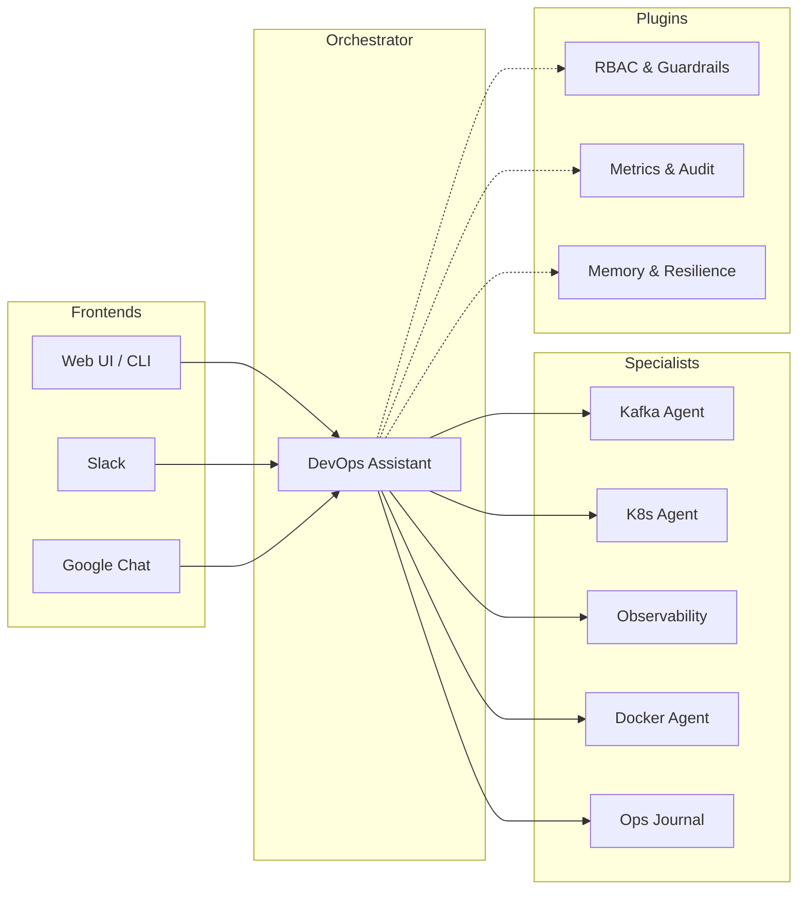

# 🤖 AI Agents for DevOps & SRE

An open-source framework for building autonomous DevOps and SRE agents. Built with [Google ADK](https://google.github.io/adk-docs/) and managed as a [uv workspace](https://docs.astral.sh/uv/).

{ align=center }

## Pick your path

-   :material-play-circle:{ .lg .middle } __I want to try it__

    ---

    Run the full stack locally in Docker in under 5 minutes — Kafka, Postgres, Prometheus, and the orchestrator ready to go.

    [:octicons-arrow-right-24: Quick start with Docker](getting-started.md#quick-start-docker)

-   :material-rocket-launch:{ .lg .middle } __I want to deploy it__

    ---

    Helm chart, multi-replica Postgres sessions, HPA, rolling updates, and observability scrape targets.

    [:octicons-arrow-right-24: Production deployment](deployment.md)

-   :material-hammer-wrench:{ .lg .middle } __I want to extend it__

    ---

    Add your own specialist agent, wire it into the orchestrator, and ship it behind the same RBAC + guardrails.

    [:octicons-arrow-right-24: Adding a new agent](adding-an-agent.md)

-   :material-chat:{ .lg .middle } __I want a chat surface__

    ---

    Bring the agents into Slack or Google Chat with interactive Approve / Deny cards and email/user-ID RBAC.

    [:octicons-arrow-right-24: Integrations overview](integrations.md)

---

## 🏗️ Architecture Overview

The platform follows a **Coordinator-Specialist** pattern. A root orchestrator analyzes user intent and delegates to specialized agents. Cross-cutting concerns like safety, observability, and resilience are handled globally via a plugin system.

---

## ⚡ Jump to a topic

-   :material-view-list:{ .lg .middle } __[Agents overview](agents-overview.md)__

    ---

    What's in the box — every agent, its tools, and the role each tool requires.

-   :material-shield-lock:{ .lg .middle } __[Guardrails & RBAC](guardrails.md)__

    ---

    Three risk tiers, three roles, and how the confirmation gate works end-to-end.

-   :material-brain:{ .lg .middle } __[Cross-session memory](memory.md)__

    ---

    Let agents recall past incidents, resolutions, and team preferences.

-   :material-chart-bar:{ .lg .middle } __[Observability](metrics.md)__

    ---

    Prometheus metrics, circuit breaker state, and LLM token accounting.

-   :material-lifebuoy:{ .lg .middle } __[Troubleshooting](troubleshooting.md)__

    ---

    Common errors across every surface with pointers to the fix.

---

## 🧠 Core Philosophy

1.  **Safety First:** No destructive tool executes without verified human confirmation.
2.  **Autonomous Investigation:** Agents run diagnostics in parallel, mimicking an SRE's thought process.
3.  **Closed-Loop Remediation:** Actions are always followed by verification and retry loops.
4.  **Observable by Design:** Every interaction is instrumented with Prometheus metrics and audit logs.

---

## 📂 Project Structure

| Component | Path | Description |
|-----------|------|-------------|
| [**core**](core/README.md) | `core/` | Shared library: agent factories, plugin system, validation, and base configurations. |
| [**agents**](agents/devops-assistant.md) | `agents/` | Specialist agent implementations (Kafka, K8s, Docker, etc.). |
| [**infra**](config/general.md#infrastructure) | `infra/` | Local diagnostic stack (Prometheus, Loki, Kafka, Grafana). |
| [**roadmap**](enhancements/README.md) | `docs/enhancements/` | Ongoing development and enhancement proposals (AEP). |
