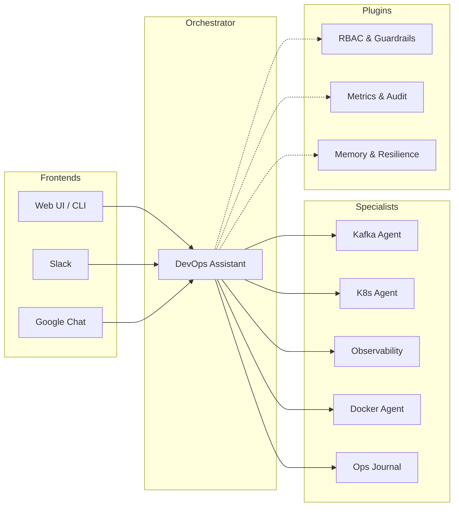

# AI Agents for DevOps & SRE

[](https://github.com/BAHALLA/devops-agents/actions/workflows/ci.yml)
[](https://github.com/BAHALLA/devops-agents/blob/main/LICENSE)
[](https://www.python.org/downloads/release/python-3110/)
[](https://docs.astral.sh/uv/)

An open-source platform for building **autonomous DevOps and SRE agents**. Built with [Google ADK](https://google.github.io/adk-docs/) and managed as a [uv workspace](https://docs.astral.sh/uv/concepts/workspaces/).

Agents monitor infrastructure, diagnose issues, and take action — with built-in safety guardrails that require human confirmation before any destructive operation.


---

## Highlights

| | |
|---|---|
| **Multi-Agent Orchestration** | A root agent delegates to specialists via `AgentTool` and deterministic sub-agent workflows. [Learn more](agent-design-patterns.md) |
| **Safety Guardrails** | `@destructive` and `@confirm` decorators gate dangerous operations. RBAC (viewer/operator/admin) enforced globally via plugins. [ADR-001](adr/001-rbac.md) |
| **Cross-Session Memory** | Agents recall past incidents and investigations. Sensitive data is automatically redacted before storage. [Setup guide](memory.md) |
| **Multi-Provider LLM** | Switch between Gemini, Claude, OpenAI, Ollama, or any LiteLLM provider with two env vars. [Configuration](config/general.md) |
| **Multi-Interface** | Chat from the ADK web UI, terminal, Slack, or Google Chat — same RBAC everywhere. [Integrations](integrations.md) |
| **Observable & Resilient** | Prometheus metrics, structured JSON logging, audit trails, circuit breakers, and retry with backoff. [Metrics](metrics.md) |

---

## Architecture

The platform uses a **coordinator pattern** where a root agent delegates to specialist agents, with cross-cutting concerns handled by plugins:



??? info "Detailed agent hierarchy"

    The `devops-assistant` orchestrator uses two delegation patterns ([ADR-002](adr/002-agent-tool-vs-sub-agents.md)):

    - **`AgentTool`** for LLM-routed specialist queries
    - **Sub-agents** (`SequentialAgent` / `ParallelAgent`) for deterministic workflows

    ```
    devops_assistant (root orchestrator)
    ├── [AgentTool] kafka_health_agent
    ├── [AgentTool] k8s_health_agent
    ├── [AgentTool] observability_agent
    ├── [AgentTool] docker_agent
    ├── [AgentTool] ops_journal_agent
    └── [sub-agent] incident_triage_agent (Sequential)
        ├── health_check_agent (Parallel)
        │   ├── kafka_health_checker
        │   ├── k8s_health_checker
        │   ├── docker_health_checker
        │   └── observability_health_checker
        ├── triage_summarizer
        └── journal_writer
    ```

---

## Agents

| Agent | Description |
|-------|-------------|
| [**core**](core/README.md) | Shared library: agent factory, plugins (RBAC, guardrails, metrics, audit, memory, resilience), persistent runner, typed config |
| [**kafka-health**](agents/kafka-health.md) | Kafka cluster health, topics, consumer groups, lag |
| [**k8s-health**](agents/k8s-health.md) | Kubernetes nodes, pods, deployments, logs, events |
| [**observability**](agents/observability.md) | Prometheus metrics/alerts, Loki log queries, Alertmanager |
| [**docker**](agents/docker-agent.md) | Docker containers, logs, stats, compose status |
| [**devops-assistant**](agents/devops-assistant.md) | Multi-agent orchestrator composing all above agents |
| [**ops-journal**](agents/ops-journal.md) | Notes, preferences, session tracking with persistent storage |
| [**slack-bot**](agents/slack-bot.md) | Slack integration with thread-based sessions and confirmation buttons |

---

## Quick Start

### Docker (no install required)

The only prerequisite is [Docker](https://docs.docker.com/get-docker/) and an API key.

=== "Gemini (default)"

    ```bash
    GOOGLE_API_KEY=your-key docker compose --profile demo up -d
    open http://localhost:8000
    ```

=== "Claude"

    ```bash
    MODEL_PROVIDER=anthropic MODEL_NAME=anthropic/claude-sonnet-4-20250514 \
      ANTHROPIC_API_KEY=sk-ant-... docker compose --profile demo up -d
    ```

=== "OpenAI"

    ```bash
    MODEL_PROVIDER=openai MODEL_NAME=openai/gpt-4o \
      OPENAI_API_KEY=sk-... docker compose --profile demo up -d
    ```

This starts Kafka, Zookeeper, Prometheus, Loki, Alertmanager, and the devops-assistant with a chat UI.

<a id="configuration"></a>
### Local Development

```bash
make install      # install all workspace packages
make infra-up     # start Kafka, Zookeeper, Prometheus, Loki, Alertmanager
make run-devops   # launch the devops-assistant in ADK Dev UI
```

Run `make help` to see all available commands.

### Prerequisites

- **Docker only** for the quick start above
- For local dev: [uv](https://docs.astral.sh/uv/), [Docker](https://docs.docker.com/get-docker/), and a Google AI Studio API key or Vertex AI project

---

## Testing

Run the full suite (439 unit tests + 22 agent evals):

```bash
make test    # unit tests (no LLM required)
make eval    # agent evaluations (requires LLM credentials)
```

All external dependencies are mocked — no running infrastructure needed. See [AEP-002](enhancements/aep-002-agent-evaluation.md) for eval details.

---

<a id="slack-bot"></a>
## Contributing

Contributions are welcome! See the [contributing guide](https://github.com/BAHALLA/devops-agents/blob/main/CONTRIBUTING.md) and [adding a new agent](adding-an-agent.md) for how to get started.

## License

[MIT License](https://github.com/BAHALLA/devops-agents/blob/main/LICENSE)
