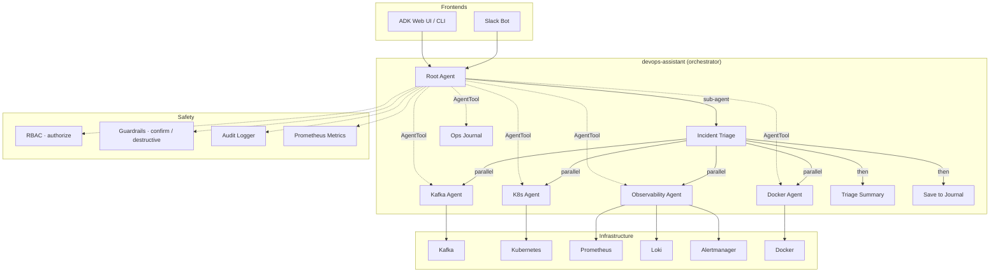

# AI Agents for DevOps & SRE

[](https://github.com/BAHALLA/ai-agents/actions/workflows/ci.yml)
[](https://github.com/BAHALLA/ai-agents/blob/main/LICENSE)
[](https://www.python.org/downloads/release/python-3110/)
[](https://docs.astral.sh/uv/)

An open-source platform for building autonomous DevOps and SRE agents. Built with [Google ADK](https://google.github.io/adk-docs/) and managed as a [uv workspace](https://docs.astral.sh/uv/concepts/workspaces/).

Agents can monitor infrastructure, diagnose issues, and take action — with built-in safety guardrails that require human confirmation before any destructive operation. Interact via the ADK web UI, terminal, or directly from Slack.


## Key Features

- **Multi-agent orchestration** — a root agent delegates to specialist agents via `AgentTool` (LLM-routed) and deterministic sub-agent workflows ([ADR-002](adr/002-agent-tool-vs-sub-agents.md))
- **Structured workflows** — `SequentialAgent` and `ParallelAgent` for deterministic multi-step pipelines (e.g., incident triage checks Kafka, K8s, Docker, and observability in parallel, then summarizes)
- **Slack integration** — chat with the agent from Slack, with interactive Approve/Deny buttons for guarded operations
- **ADK Plugins** — cross-cutting concerns (RBAC, guardrails, metrics, audit, activity tracking, resilience, error handling) are packaged as ADK plugins and registered once on the Runner via `default_plugins()` — no per-agent callback wiring
- **Async tools** — all tool functions are `async def` using `asyncio.to_thread()` for non-blocking I/O
- **Role-based access control** — three-role hierarchy (viewer/operator/admin) inferred from guardrail decorators; enforced globally via `GuardrailsPlugin` ([ADR-001](adr/001-rbac.md))
- **Input validation** — all tool inputs validated at the boundary with reusable validators (string length, integer range, URL scheme, path traversal, regex patterns)
- **Safety guardrails** — destructive tools (`@destructive`) require explicit confirmation; mutating tools (`@confirm`) prompt before executing; confirmations are args-hashed and time-limited
- **Structured logging** — JSON-formatted logs to stdout, ready for Loki/ELK/Cloud Logging; every tool call is audited with timestamp, agent, arguments, and result
- **Persistent sessions** — SQLite-backed session state, user-scoped notes, and app-wide shared data that survive restarts
- **Multi-provider LLM support** — switch between Gemini, Claude, OpenAI, Ollama, or any [LiteLLM-supported provider](https://docs.litellm.ai/docs/providers) via environment variables
- **Prometheus metrics** — tool call counts, latency histograms, error rates, circuit breaker state, and LLM token tracking exposed via `/metrics` for Prometheus scraping
- **Resilience** — circuit breaker and retry with exponential backoff for transient failures
- **Composable architecture** — each agent is a standalone package that can run independently or plug into an orchestrator

## Architecture



## Agents

| Agent | Type | Description |
|-------|------|-------------|
| [**core**](core/README.md) | Library | Agent factory, ADK plugins, RBAC, guardrails, input validation, error handlers, structured logging, audit trail, activity tracking, Prometheus metrics, persistent runner, typed config |
| [**kafka-health-agent**](agents/kafka-health.md) | Single agent | Kafka cluster health, topics, consumer groups, lag |
| [**k8s-health-agent**](agents/k8s-health.md) | Single agent | Kubernetes cluster health, nodes, pods, deployments, logs, events |
| [**observability-agent**](agents/observability.md) | Single agent | Prometheus metrics/alerts, Loki log queries, Alertmanager silence management |
| [**devops-assistant**](agents/devops-assistant.md) | Multi-agent | Orchestrator using AgentTool for specialist agents and sub-agents for deterministic workflows |
| [**ops-journal**](agents/ops-journal.md) | Memory/state | Notes, preferences, and session tracking with persistent storage |
| [**slack-bot**](agents/slack-bot.md) | Integration | Slack bot with thread-based sessions and interactive confirmation buttons |

## Quick Start

### Try it with Docker (no install required)

The only prerequisite is [Docker](https://docs.docker.com/get-docker/) and an API key from any supported provider.

```bash
# With Google AI Studio (default)
GOOGLE_API_KEY=your-key docker compose --profile demo up -d

# With Anthropic Claude
MODEL_PROVIDER=anthropic MODEL_NAME=anthropic/claude-sonnet-4-20250514 \
  ANTHROPIC_API_KEY=sk-ant-... docker compose --profile demo up -d

# With OpenAI
MODEL_PROVIDER=openai MODEL_NAME=openai/gpt-4o \
  OPENAI_API_KEY=sk-... docker compose --profile demo up -d

# Open the web UI
open http://localhost:8000
```

This starts Kafka, Zookeeper, Kafka UI, Prometheus, Loki, Alertmanager, and the devops-assistant agent with a chat interface. See the [configuration reference](configuration.md) for all supported providers and API key setup.

### Local development

```bash
make install      # install all workspace packages
make infra-up     # start Kafka, Zookeeper, Prometheus, Loki, Alertmanager
make run-devops   # launch the devops-assistant in ADK Dev UI
```

Run `make help` to see all available commands.

### Prerequisites

- **Docker only** for the quick start above
- For local development: [uv](https://docs.astral.sh/uv/), [Docker](https://docs.docker.com/get-docker/), and a Google AI Studio API key or Vertex AI project

## Slack Bot

Chat with the agent directly from Slack — each thread is a separate conversation, with interactive Approve/Deny buttons for guarded operations.

→ **[Full setup guide](slack-setup.md)** (app manifest, env vars, run commands)

## Metrics

Every tool call across all agents is instrumented with Prometheus metrics — latency histograms, error rates, invocation counts, and circuit breaker state. The Slack bot exposes a `/metrics` endpoint on port 9100 for Prometheus scraping.

> **[Metrics reference](metrics.md)** (available metrics, PromQL examples, integration guide)

## Configuration

Each agent loads typed settings from `.env` files via Pydantic. Every agent ships a `.env.example` next to its module (e.g. `agents/kafka-health/kafka_health_agent/.env.example`) documenting every supported variable — copy it to `.env` in the same directory and fill in your values. Shared variables (LLM provider, GCP project) plus per-agent settings (broker addresses, API tokens, etc.) are documented in the configuration reference.

→ **[Configuration reference](configuration.md)** (env vars, infrastructure ports, Docker Compose profiles)

## Testing

Run the full suite (404 tests):

```bash
make test
```

Run tests for a single package:

```bash
uv run pytest agents/kafka-health/tests/ -v
```

All external dependencies (Kafka, Kubernetes, Docker, Slack) are mocked — no running infrastructure needed.

## Adding a New Agent

→ **[Step-by-step guide](adding-an-agent.md)** with boilerplate, RBAC setup, and testing tips.

## Contributing

Contributions are welcome! See [CONTRIBUTING.md](https://github.com/BAHALLA/ai-agents/blob/main/CONTRIBUTING.md) for guidelines on adding new agents, improving existing ones, and submitting pull requests.

## License

This project is licensed under the [MIT License](https://github.com/BAHALLA/ai-agents/blob/main/LICENSE).
