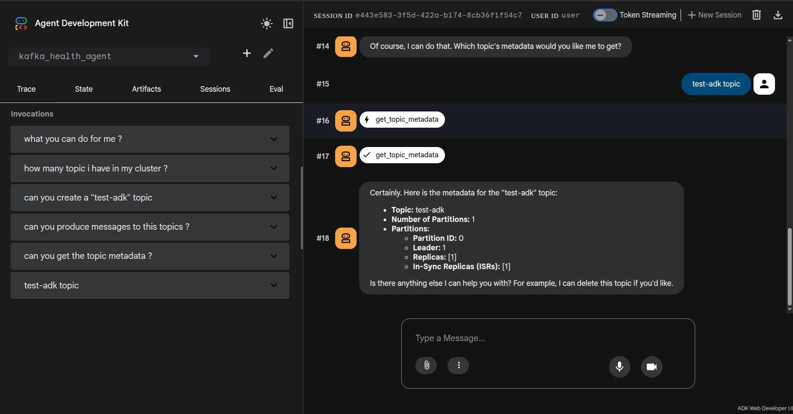

# Kafka Health Agent

A specialized autonomous agent for monitoring and managing Kafka clusters, built with [Google ADK](https://google.github.io/adk-docs/) and [confluent-kafka](https://github.com/confluentinc/confluent-kafka-python).

## Overview

The Kafka Health Agent provides a natural language interface to interact with your Kafka cluster. It can check cluster health, manage topics, and retrieve detailed metadata about brokers and partitions.

## Visuals



## Setup

### Prerequisites

- [uv](https://docs.astral.sh/uv/) for Python package management.
- [Docker](https://www.docker.com/) and [Docker Compose](https://docs.docker.com/compose/) for the local Kafka cluster.
- A Google Cloud Project with Vertex AI enabled.

### 1. Local Kafka Cluster

Start the included Kafka stack (Zookeeper, Kafka, Kafka UI, Schema Registry):

```bash
docker compose up -d
```

- **Kafka UI**: [http://localhost:8080](http://localhost:8080)
- **Schema Registry**: [http://localhost:8081](http://localhost:8081)
- **Kafka Broker**: `localhost:9092`

### 2. Agent Configuration

Create/update your `.env` file in `kafka_health_agent/.env`:

```bash
# General AI configuration
GOOGLE_GENAI_USE_VERTEXAI=TRUE
GOOGLE_CLOUD_PROJECT=your-project-id
GOOGLE_CLOUD_LOCATION=your-region
GEMINI_MODEL_VERSION=gemini-2.0-flash # recommended

# Kafka-specific configuration
KAFKA_BOOTSTRAP_SERVERS=localhost:9092
```

### 3. Install Dependencies

```bash
uv sync
```

## Agent Capabilities (Tools)

The agent is equipped with the following tools to manage your cluster:

- **`get_kafka_cluster_health`**: Checks connectivity and reports the number of online brokers and their details.
- **`list_kafka_topics`**: Returns a list of all topics currently in the cluster.
- **`get_topic_metadata`**: Provides detailed information about a specific topic, including partitions, leaders, replicas, and ISRs.
- **`create_kafka_topic`**: Allows creating new topics with custom partition counts and replication factors.
- **`delete_kafka_topic`**: Deletes an existing topic from the cluster.

## Project Structure

```text
kafka-health-agent/
├── assets/                  # Documentation assets (screenshots)
├── kafka_health_agent/      # Agent Python package
│   ├── __init__.py          # Package entry point
│   ├── agent.py             # Agent logic and tools
│   └── .env                 # Local configuration (gitignored)
├── docker-compose.yml       # Kafka stack (Zookeeper, Kafka, UI, etc.)
├── pyproject.toml           # Dependencies (google-adk, confluent-kafka)
└── README.md                # Documentation
```

## Usage

From the `kafka-health-agent/` directory:

```bash
# Launch the ADK Web UI (Recommended for interactive use)
uv run adk web

# Run directly in the terminal
uv run adk run kafka_health_agent

# Start as an API server
uv run adk api_server
```
